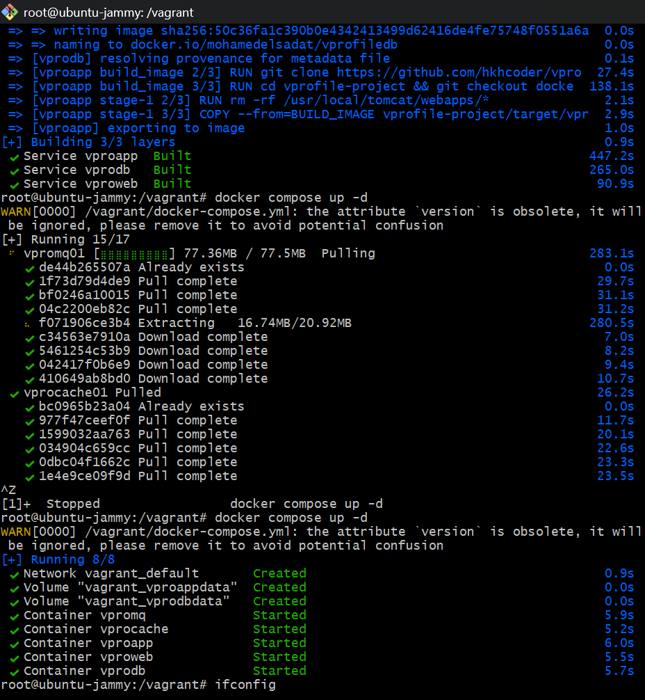
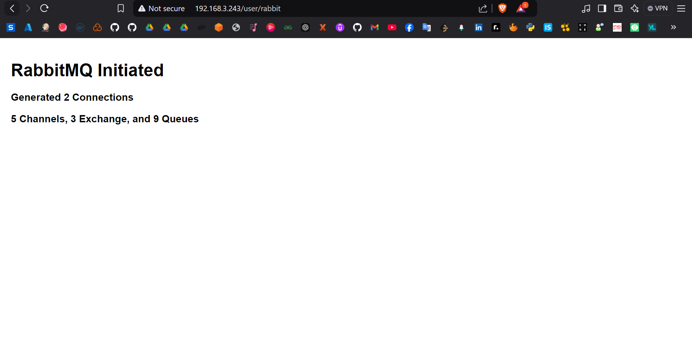
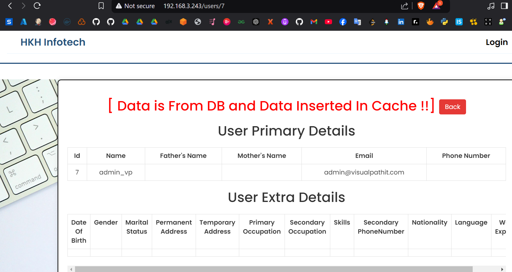
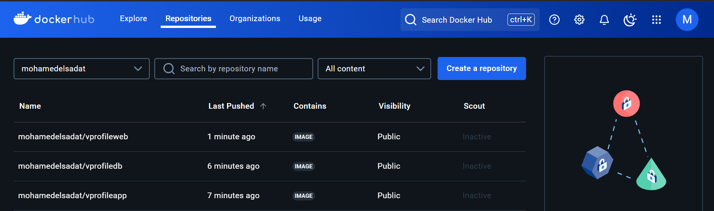

# Project Title: Multi-Service Containerization

## Overview

This project demonstrates the containerization of multiple services for a seamless and efficient deployment. The services include:

1. **NGINX**: Used as a web service.
2. **Tomcat**: Runs a web application built using Maven.
3. **Git Repository**: Source code repository.
4. **MySQL**: Database service.
5. **Memcached**: Caching layer.
6. **RabbitMQ**: Message broker.

The setup leverages Docker to containerize these services and provides an environment for easy orchestration.

------

## Features

- **Modular Architecture**: Each service runs in its own container for isolation and scalability.
- **Automated Builds**: Maven is used to build the Tomcat application.
- **Persistent Storage**: MySQL data is stored persistently.
- **Efficient Caching**: Memcached reduces database load.
- **Messaging**: RabbitMQ handles asynchronous communication.

------

## Prerequisites

1. Docker and Docker Compose installed on your machine.
   - [Install Docker](https://docs.docker.com/get-docker/)
   - [Install Docker Compose](https://docs.docker.com/compose/install/)
2. At least **2 CPUs** and **4GB RAM** available for the containers.

------

# VProfile Project

## Overview
The **VProfile Project** is a web-based application designed to demonstrate a multi-tier architecture using Docker and Docker Compose. This project includes a frontend deployed on Tomcat, a backend service running on MySQL, and configurations for setting up and running the application seamlessly.

## Features
- Multi-tier architecture with frontend and backend components.
- Dockerized for simplified deployment and scalability.
- Pre-configured MySQL database with sample data.
- Automated build process using Maven.

## Prerequisites
To set up and run the project, ensure the following tools are installed on your system:

- [Docker](https://www.docker.com/) (v20.10 or later)
- [Docker Compose](https://docs.docker.com/compose/) (v1.29 or later)

## 

### Dockerfiles
1. **`Dockerfile-build`**: Builds the project using Maven.
2. **`Dockerfile-frontend`**: Configures the Tomcat server for the application frontend.
3. **`Dockerfile-backend`**: Configures the MySQL database with a preloaded schema and data.

### `docker-compose.yml`
The Compose file defines the services, networks, and volumes needed to deploy the application.

### `db_backup.sql`
This file contains the SQL dump used to initialize the MySQL database.


### Step 2: Build Docker Images
1. **Frontend Image**
   ```bash
   docker build -f Dockerfile-frontend -t vprofile-frontend .
   ```
2. **Backend Image**
   ```bash
   docker build -f Dockerfile-backend -t vprofile-backend .
   ```
3. **Build Image (Optional)**
   ```bash
   docker build -f Dockerfile-build -t vprofile-build .
   ```

### Step 3: Run with Docker Compose
To start the application:
```bash
docker-compose build
docker-compose up -d
```


This will:

- Start the MySQL database on port `3306`.
- Deploy the frontend application on port `80`.

### Step 4: Access the Application
Open a browser and navigate to:
```
http://localhost:80
```

## Database Details
The MySQL database is initialized with a schema and sample data:

- **Database Name**: `accounts`
- **Tables**: `role`, `user`, `user_role`
- **Sample Credentials**:
  - Username: `admin_vp`
  - Password: `admin_vp`

## Check Memcached and  RabbitMQ work





## Puch to docker hub


